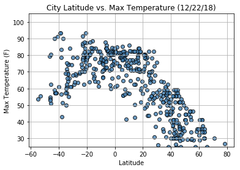
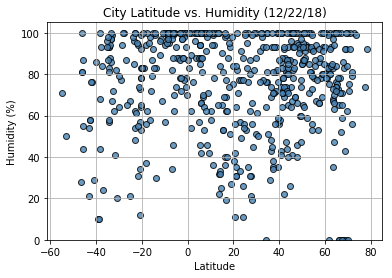
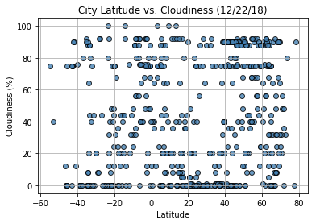
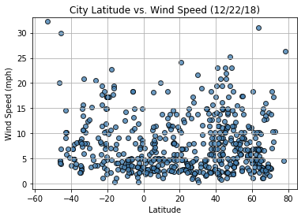

# Analysis
## City Latitude vs. Max Temperature(F):

* As we move away from the equator the temperature in northern hemsphere decreases, as is expected currently due to the winter season.What's more, as we move away from the equator in the southern hemsphere, where summer is currently the present season, the temperature also begins to decrease.

* We can conclude that there is a positive correlation between City Latitude and Max temperature(F) as we move away from the equator.

## City Latitude vs. Humidity (%):

* We can notice that as we move away from the equator (Lat 0), the humidity (%) concetration increases. We can also note that there are far more cities with higher humidity (%) between the 80-100%

## City Latitude vs. Cloudiness (%):

* There's no correlation betwen City Latitude and Cloudiness(%). We can also conclude that there most concentratiosn of cloudiness in the northern hemisphere, latitudes higher than 20.

## City Latitude vs. Wind Speed (mph):

* There no correlation between Wind Speed(%) and City Latitude. One observation we can draw is most of the Wind Speed(%) tends to concentrate between 0-8 mph, we can also note that the highest Wind Speed(%) happens at Cities in the top northern hemisphere.

------
* Whats the weather like? -[ Requirements ](https://github.com/mjvillacresesn/Weather-Changes/blob/master/WeatherPy/README.md)
* Jupyter Notebook - [ Code ](https://github.com/mjvillacresesn/Weather-Changes/blob/master/WeatherPy/WeatherChanges.ipynb)
